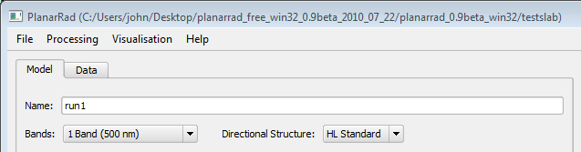
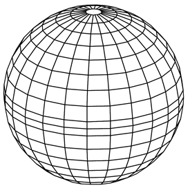
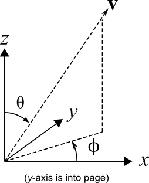
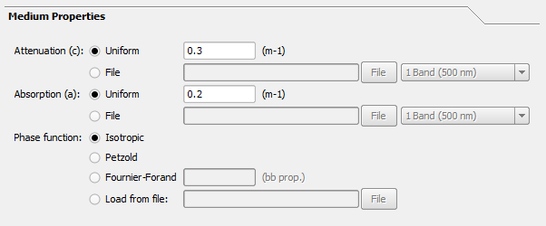
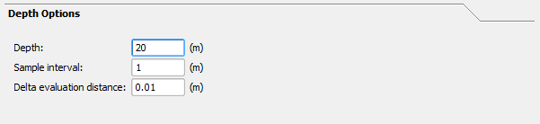
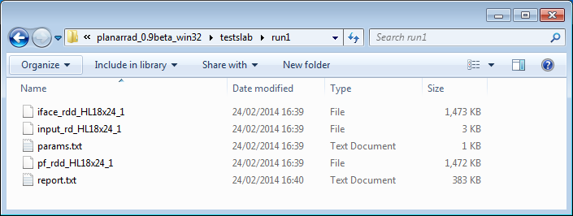
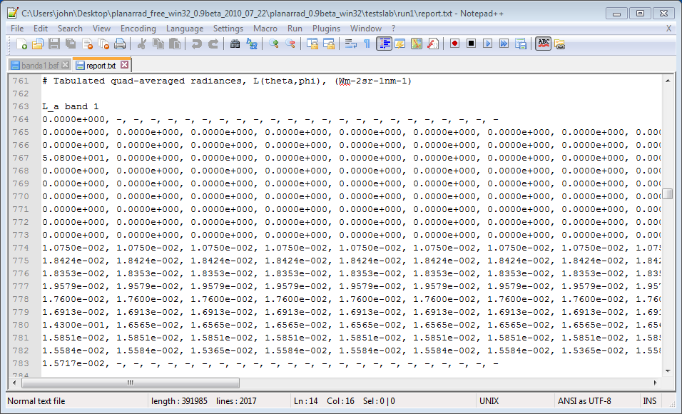
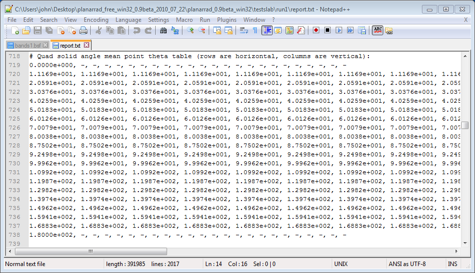
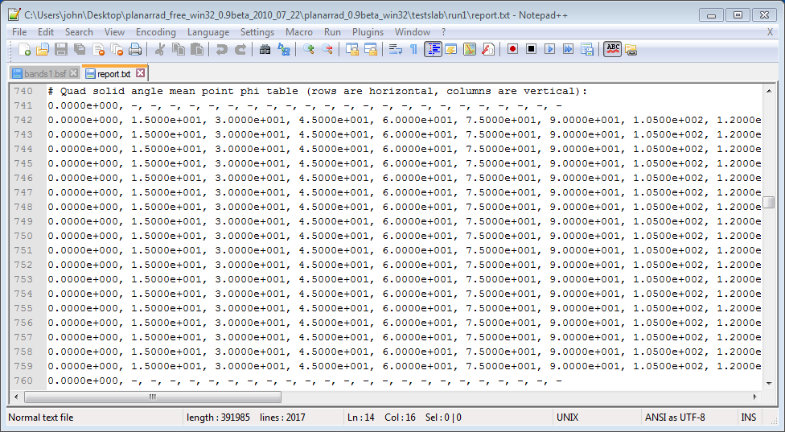

# BRDF of a material with isotropic phase function
NB: OBSOLETE. The GUI for this has been temporarily removed. At some point I will change this to use the CLI, and/or add back in the GUI.

This example shows how to model the bidirectional reflectance distribution function (BRDF) of a material for which the extinction and absorption co-efficients are known and we can assume the phase function is isotropic. We are interested in slab of this material that is sufficiently thick that whatever is underneath it has negligible effect on its reflectance, i.e. you can't see through it. In fact we can will work out how thick that needs to be in the analysis.

The example uses the Windows version of PlanarRad. It will involve working with a few text files for which you can use Wordpad. In general Notepad does not work because (I think) it doesn't handle the Unix-style line endings. However I strongly recommend using [Notepad++](https://notepad-plus-plus.org/) or [VSCode](https://code.visualstudio.com/) for working with text files under Windows -the screenshots here are taken with Notepad++. 

## Step 1: Set up single band run
We will be working with a single wavelength so we need to set up a small band specification file to specify this. Create a text file called 'bands1.bsf', or alternatively edit 'bands17.bsf' that can be found in the 'planarrad_test04' directory. Make it look like this:


A few notes of explanation:

    bs_name - this is what will appear in PlanarRad to refer to this band specification.
    bs_code - this will be appended onto the name of some automatically generated files.
    band_count - the number of bands.
    band_widths_data - a comma separated list of the widths of the bands in nanometeres.
    band_centres_data - a comma separated list of the centre wavelengths if the bands in nanometres.
    preferred_default - if 'yes' the PlanarRad GUI will offer this band specification as the default.

Note that although we have specified the band as centred at 500 nm and being 10 nm wide, this is irrelevant in what follows because we will be manually setting all the optical properties for a single wavelength run. Nowhere in the model will '500 nm' actually be used in any calculation, and so this same procedure and the same 'bands1.bsf' file can be used for runs at any wavelength.

Now create new folder called 'testslab' (or whatever) and save 'bands1.bsf' in it.


Now run PlanarRad and from the menus choose 'File > Change current working directory' and select the 'testslab' directory that contains the band specification file. You should see that 'Bands:' under the 'Model' tab changes to '1 Band (500 nm)'. I.e. it should look like this:



It is sensible at this point to give the run a name, as in 'run1' here. When the run is processed folder called 'run1' will be saved in the 'testslab' directory and any outputs will be found there. 

## Step 2: Be aware of the directional discretisation in use
The selected entry of 'HL Standard' next to 'Directional Structure' of means that PlanarRad will decompose the sphere of all directions into segments or 'quads' in the same way that HydroLight does. This means the upward and downward hemispheres are split into 9 by 24 segments of constant zenith and azimuth angle, plus and end-cap, as below.




The diagram on the right indicates how the zenith angle, θ, and azimuth, Φ, specifies a direction. Every direction therefore lies within a corresponding segment. PlanarRad, like Hydrolight, works with the 'quad averaged radiance' which means when we talk about the radiance in a particular direction we are talking about the radiance averaged over one of these segments. For evaluating BRDFs we will later deal with a table of numbers, which represent the radiance in each of these segments in the upward hemisphere leaving the surface of the slab.

The zenith angles of the lines that seperate the quads are at the following degrees:
```
0, 5, 15, 25, 35, 45, 55, 65, 75, 85, 90, 95, 105, 115, 125, 135, 145, 155, 165, 175, 180
```
In other words, the angular centres of the quads are at these θ values:
```
0, 10, 20, 30, 40, 50, 60, 70, 80, 87.5, 92.5, 100, 110, 120, 130, 140, 150, 160, 170, 180
```
The average radiance in particular segment can be considered as an approximation of the radiance at these particular θ angles. However, because the segments are not actually rectangles, but are in general wider at the bottom than at the top, the centre with respect to solid angle is slightly closer to the equator of the the sphere than the mid-point of the theta limits. These quad averaged theta angles can be found in the report file under the heading 'Quad solid angle mean point theta table'. These theta angles are arguably a better choice when aligning the value in a segment with particular theta value.

Azimuthally the segments are arranged such that zero Φ corresponds the centre of a segment. The segment centre azimuth angles are:
```
0, 15, 30, 45, 60, 75, 90, 105, 120, 135, 150, 165, 180, 195, 210, 225, 240, 255, 270, 285, 300, 315, 330, 345
```
The segment at (θ, Φ) of (0, 0) or (180, 0) is the end-cap, so the total number of segments in a hemisphere is a table of 9 x 24 plus the end-cap, i.e. 217 values. Over the sphere of all directions is 18 x 24 plus 2 end-caps, i.e. 432 segments in the whole sphere.

The sun has a much smaller solid angle than one of these segments, so some precision is lost in this directional treatment, however typically the effect is so small it's not worth worring about. It is comparitively easy to increase the directional resolution by adding an appropriate directional structure text file to the working directory, just as was described previously for the band specification file. This will be described elsewhere.

Note that in hydrological optics the direction z is depth into the water and increases downwards. Therefore in general z points downwards through the slab of media and is zero at the air-media interface. The figure above is probably upside-down compared to the situation being modelled.

## Step 3: Outline of basic procedure

The most straightforward use of PlanarRad is to model the directional radiance leaving the top of the slab of media for given incident radiance distribution. That is, PlanarRad doesn't output the full BRDF directly but instead outputs the reflected light from a specific incident light field. Since the downward incident radiance in one wavelength band is characterised by a table of 217 values (the downward hemisphere), and the upward 'exitant' radiance is similarly tabulated by 217 entries (the upward hemisphere), then the full BRDF would be a 217 x 217 table of numbers, that describe how the radiance incident in each solid-angle segment would distribute to all 217 exitant solid angle segments.

One way to use PlanarRad to fill this 217 x 217 table of numbers is therefore to run it 217 times, each time all the incident light being confined to just one solid-angle segment. The exitant radiance is then the relative BRDF response for that incident direction. However there is no need to do all 217 runs, because the system is rotationally invariant, that is if the input radiance is at azimuth 30 degrees, then the output will just be the same as for azimuth zero degrees but rotated by 30 degrees. Therefore with the 'HL Standard' directional distribution the BRDF can be fully characterised with just 10 runs for zenith angles (θ) of 0, 10, 20, 30, 40, 50, 60, 70, 80, 87.5 degrees, and azimuth (Φ) fixed at zero degrees.

The following steps describe how to perform the modelling for one incident direction.

We will work downwards through the setting pages starting at 'Input Radiance Distribution'.
## Step 4: Input Radiance Distribution

Let's say we are interested in the directional reflectance arising from light incident at zenith (θ) 30 degrees and azimuth (Φ) 0 degrees. We need to set up the input radiance so that it is zero in all segments except the one centred at θ = 30, Φ = 0. This can be done with the 'HL Idealized' sky model by setting the 'Diffuse Irradiance Ratio' to zero, as below:


In this context the 'Cosine parameter' has no effect and can be left as 1.
## Step 5: Interface Properties

We assume that the interface between the slab of material and the air (or whatever is above it) is perfectly flat, and enter the relative refractive indices, as below. In this example the material refractive index is 1.1 and air is left as 1.0.


Note that in this case, where the refractive index of the material is greater than air the slab will have some specular reflectance or be a bit shiny simply as a consequence the Fresnel equations. Since the surface is perfectly flat the specular reflection should be very narrow in angular terms, but this won't be fully captured by the outputs because PlanarRad works only with the average radiances in the segments of the sphere. The angular resolution is limited to that of the discretisation of the sphere. However it is important to realise that this is not an innaccuracy in itself, it is correct inasmuch as it is the average radiance over the segment of the sphere which is modelled, but it is just that, an average radiance. If a small bright spot exists within a segment its radiance is effectively spread over that segment. This can lead to small innaccuracies in representing the spreading of narrow light sources at angles close to the source [Todo: this will be shown elsewhere].
## Step 6 : Medium Properties

This is where you enter the extinction, or equivalently attenuation, c, and the absorption co-efficient, a. They can be entered directly as we are performing a single wavelength run. In this example we select an isotropic phase function.




In this example the extinction is 0.3 m-1 and the absorption coefficient is 0.2 m-1. As a sanity check the extinction must be equal or greater than the absorption. If it is not when you process the run you may get a weird error like 'matrix inversion failed'.

Note that the units for the attenuation and absorption are expressed as per metre, which may not be convienient for your application. However throughout PlanarRad 'metre' can notionally be replaced by any dimension and the result will be correct as long that is consistently applied. For example, if everywhere you see metre you assume 'mm' everything is still correct.

## Step 7: Depth Options

This sets the thickness of the slab of material, in this example 20 m. The entries 'Sample interval' and 'Delta evaluation distance' are for capturing the light field at certain points within the media. They need to be set, i.e. numbers must be entered or PlanarRad will probably crash. It's useful to enter something like one tenth or less of the total depth for 'Sample interval' because then you will get a visualisation of the light field at ten depths through the media, which is useful to understand what's happening. 'Delta evaluation distance' should be set to a number that is small compared to 'Sample interval', it is just used for internal calculation of the rate of change of the light field at the sample points.



## Step 8: Lower Boundary Properties

Here we set the reflectance of whatever is underneath the slab at the thickness previously set as 'depth'. In this example we assume that we are interested in a slab of medium that is sufficiently thick that what is below it is irrelevant, so we set the reflectance to zero. However we will later check that this assumption is valid.


## Step 9: Process the run

Now click the 'Process' button and the run should proceed with various activity in the status and progress bars. If PlanarRad crashes it's likely that a box where a number should be entered was left empty or had an entry that was not valid.

Note that you can save the current set-up by clicking 'File > Save Model Parameters'. Save the parameters file under the 'testslab' directory in the same place as the 'bands1.bsf' file. This ensures the band specification can be found. If you save it somewhere else the current working directory will be changed and you will suddenly lose the "1 Band (500 nm)" option. You can get it back by going 'File > Change Current Working Directory' and finding 'testslab' again.
## Step 10: Review the visualisations


On the right hand side you should see something like this. It shows the profile of downwelling planar irradiance in the slab of media. What is good is that it reaches pretty much zero before it gets to the bottom. This implies the slab in this case is thick enough that you don't need to worry about light penetrating through it and reflecting from whatever is below. If you weren't sure you could repeat the run with a non-zero bottom boundary reflectance and check the numbers that we will come to later.

The other image on the top right is either of these depending on if 'Ld' or 'Lu' is selected:

     


This shows a hemispherical 'fish-eye' view from just below the air-media interface, i.e. inside the media. In the 'Ld' option the fish-eye is looking upwards showing the distribution of downwelling radiance. The white segment is the light source as it appears transmitted through the air-media interface. Above the interface this is just one segment, but because of refraction just below the surface it is spread over two segments. The bright bands at the edge of the fish-eye view are internal reflection from the under-side of the air-media interface. The colours are fairly meaningless because we have done a single wavelength run, it's PlanarRad's interpretation of 500 nm as a colour.

In the 'Lu' option the hemispherical view is downwards, looking at the upwelling radiance distribution. This is the first hint at the reflected light distribution we need for the BRDF, but it is just below the air-media interface, inside the media. The exitant light distribution will be directionally modified by refracted transmission through air-media interface, some of it will be retained in the media by internal reflectance and above the interface there will also be an additional direct specular Fresnel reflectance component.
## Step 11: Get the report file

Finally, what we need to evaluate the BRDF is available in the output report file that is called 'report.txt' and has been placed in the run directory, in this example called 'run1' under 'testslab'. I.e. you should be able to find this in Windows Explorer:




Open the file 'report.txt' with WordPad or Notepad++, using a mouse right-click. Don't double-click on it as likely this will open it in Windows bog-standard Notepad that will display it just as a solid mass of text. Alternatively you can open the file in Excel, and if you set the delimiter as comma it will read in the file with the tables of numbers sensibly arranged.

You will see the report contains many outputs of interest, scroll down to the entry marked 'L_a Band 1', looks like this:




These are the segment averaged radiances over the sphere of all directions just above the air-media interface. Each row of numbers is one horizontal band around the sphere, i.e. for a specific zenith angle. The numbers start at azimuth zero degrees and increment in 15 degree steps going to the right. The top row corresponds to a zenith angle (θ) of zero, it has only one entry which is the end cap. The next row is the top set of segments that circle the end cap, representing θ = 10 degrees, and so on until the bottom row with single entry which is the bottom cap.

The way to interpret the tables is that tabulated radiance is what you see of you look in that direction. Note the entire upward-looking hemisphere, the top rows of the table, are zero except the entry corresponding to θ = 30 (the fourth row) and Φ = 0 (the first number), which is 50.8 W m-2 sr-1 nm-1. This confirms that we have really illuminated our slab with light from one segment only.

The lower part of the table is the downward-looking hemisphere, and the values are the BRDF response to the illuminated direction. Note that the first entry on line 780 in the above picture. 1.43E-01, is larger than the surrounding values. This is the specular reflection direction and corresponds to looking down on the slab surface at 150 degrees to the zenith and looking in the azimuthal 0 degreees direction. The value is higher, because as previously mentioned, the slab is a bit shiny from having a refractive index greater than one and being perfectly flat.

So for a given illumination direction the values in the lower half of the table are all that is required to make a plot of the BRDF response. Each entry corresponds to a particlar (θ, Φ) direction. If there is any doubt as to which direction that is scroll up in the 'report.txt' file and note these two tables:







These tabulate the θ and Φ that correspond to each segment. The only thing to notice is that they are described as the 'mean point' angles which means they are the θ and Φ of the centre point of the segment taken as a mean over solid angle. Because the segments are slightly wedge-shaped vertically, the mean point θ values are slightly closer to the 90 degree line than the actual middle θ values we have been working with, e.g. instead of 30 degrees we have 30.37 degrees. If you want to say a segment represents a certain specific direction you might consider these mean point angles to be a best representative direction, but it makes very little difference. The strictly 'correct' way to plot this data is to make figures with stepped lines that look like a histogram, with the steps occuring at the segment boundaries.
## Step 12: What are the units of my BRDF ?

It depends how you want to express it, because there are various options. If you want to express the BRDF as a radiance-to-radiance ratio, then in the above example you would divide all the output values by 50.8, so that you would have the BRDF response in radiance for an unit incident radiance. However what is probably more common [todo - check] and seems more natural is to express the BRDF as a radiance response per unit incident planar irradiance, which gives units sr-1. In that case we would need to scale the outputs so that they correspond to a unit incident irradiance on the plane. Fortunately that is already the case because that is how the input radiance model works. so no scaling of values is necessary. This can be verified by manually performing the conversion. We need to multiply the incident radiance of 50.8 W m-2 sr-1 nm-1 by the solid angle of the segment wieghted by the cosine of θ. The solid angle of each segment is available in 'report.txt' as the table headed 'Quad solid angles' and for this segment is 2.2817E-02 sr. So the naive calculation of incident irradiance from the segment at θ = 30 degrees is:
```
2.2817E-02 x cos(30) x 50.800  = 1.0038 W m-2
```
Which is not quite right, because the segments are actually wedge-shaped and so the 'mean point theta' is a better estimate:
```
2.2817E-02 x cos(30.376) x 50.800  = 1.0000 W m-2
```
But actually the multiplier for this already provided in 'report.txt' marked 'Quad solid angle x abs cos(theta)', which gives:
```
1.9685E-02 x 50,800 = 1.0000 W m-2
```
So in conclusion, the values as they appear in the lower half of the 'L_a band 1' table are already the BRDF for that incident illumination direction, in units of sr-1. 