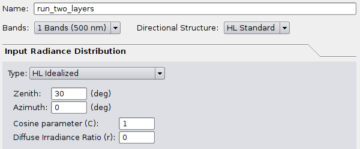

# Creating a BRDF file and using it as a bottom boundary

It is possible to use PlanarRad to generate a BRDF file that can then be used as input as the bottom boundary condition for another run. One reason to do this is to implement a layered media. Currently PlanarRad only supports vertically homogenous media, but a two layer system (for example) can be modelled by generating BRDF for the lower layer and then using that as the bottom boundary for the upper layer.

The key points are this:

 - Generating the BRDF file requires 10 runs, one for each incident theta position of 0, 10, 20, 30, 40, 50, 60, 70, 80 and 87.5 degrees.
 - For layers where the refractive index does not change substantially (most likely for layers where the embedding media is the same but constituents change) the runs for generating the BRDF file should use the 'non-existent' interface option 'None'.
 - The separate tool 'reflectool' must be run from the command line to generate the BRDF file from the ten runs.
 - Then to model the upper layer is a standard run with normal interface settings and uses the the BRDF file for the lower boundary.
 - A simple test procedure to verify everything works OK is to do a model with two layers that have same optical properties and compare that to a single run for the depth of the two layers added together, the light field in the top half of the media should be identical.

This page gives a worked example for a model of two layers and demonstrates the verification that the output is correct.

## Characterising the BRDF

To make a BRDF file requires that we have data on the full hemisphere of light reflected in every exitant direction for every incident direction, from a surface. In PlanarRad the standard directional discretisation for a hemisphere contains 217 quads, so the BRDF for one wavelength is a table of 217 x 217 numbers. To populate this table we can run PlanarRad with all the incident light in just one quad, and that will give us the 217 values, one for each exitant direction, for that particular incident direction. So on the face of it 217 PlanarRad runs would be required to characterise the whole BRDF. However, in almost all cases we can assume the BRDF is rotationally invariant.

The meaning of rotational invariance is this: Imagine you are looking at a surface from an angle and the sun is off to the right somewhere. You and the sun stay in the same place but the surface is rotated in a horizontal plane - it still looks the same. In PlanarRad currently the only way non-rotationally invariant results can be obtained is when using windblown air-water interface. Any runs using a flat or non-existent interface are rotationally invariant. The interface option of 'none' is what is normally required for a BRDF of a lower layer in a media. This means only 10 runs are required to characterise the BRDF, one for each incident theta row (zenith position) in the hemisphere. We can set the incident azimuth to zero for all runs and that will be enough information to characterise the BRDF.

## Example model

For the example here we will generate a single wavelength BRDF for a 5m depth, attenuation c = 0.3, absorption a = 0.1, Petzold phase function, and bottom boundary black (reflectance = 0). Then we will input that as the bottom boundary for another run of 5m depth with the same optical properties. The result should be the same as a 10m run with black bottom boundary. This is demonstrated below.
## Runs to characterise the BRDF (GUI)

The basic procedure is the same as described on this page: [BRDF of a material with isotropic phase function](BRDF_isotropic.md), but with a few important changes. Assuming you are able to successfully follow the procedure on that page, do this:

1) Set the interface properties to 'None'. In the parameters file the parameter is 'iface_type = absent'.


2) Set the medium optical properties. In particular we'll use Petzold's phase function and not an isotropic phase function, because Petzold's phase function is forward peaked and will induce directionality into the BRDF and be a clearer test.


3) Set the depth to 5m.


4) To generate the BRDF the lower boundary for the bottom layer will be black, i.e. the lower boundary of the whole system (the two layers) is black.


5) Now everything that has been set will be constant and we need to do 10 runs varying the direction of the incident light. That means ten runs where zenith angle is 0, 10, 20, 30, 40, 50, 60, 70, 80 and 87.5. The name of the run should be changed each time, For example 'run_theta0', 'run_theta10', 'run_theta20' ... 'run_theta_87p5'. Note the other parameters: azimuth of zero and cosine parameter of 1, diffuse ratio 0. These set all the incident light to be in a single quad at azimuth position zero. If these are not set correctly reflectool will report an error later when building the BRDF file.

So perform ten runs just changing the items highlighted below.


Note that you may see strange images like this appear in the hemispherical plot in the GUI:

Small values.png

It does not indicate an error. This is to do with the auto-scaling of the image, the additional segments are due to very small values that occur for numerical reasons, of the order of 1E-14. This can be verified by looking at the 'L_w band 1' entries in the report file.

## Runs to characterise the BRDF (scripts using slabtool)

To generate the files from a script as described on this page: Command line running (Linux) the parameters file would look like the below. The sky files and interface file need to be pre-prepared which is most easily done by GUI runs as described above. In the below I have assumed the sky files have been renamed based on the theta value as 'input0_rd_HL18x24_1', 'input10_rd_HL18x24_1', etc. and the interface file has been renamed 'iface_absent_rdd_HL18x24_1'. It is slightly confusing that these are referred to as 'sky' and 'water_surface' in the parameters, as in this context they are really just incident light and interface. So, for the ten runs the options under 'name = run_theta30' and 'sky_fp = ...' should be changed for each run.
```
name = run_theta30

band_spec_fp = bands1.bsf

partition = sphere
vn = 18
hn = 24
theta_points = 0,5,15,25,35,45,55,65,75,85,90,95,105,115,125,135,145,155,165,175,180

depth = 5
sample_point_distance = 1
sample_point_delta_distance = 0.01

sky_fp = input30_rd_HL18x24_1

water_surface_fp = iface_absent_rdd_HL18x24_1

pf_fp = pf_rdd_HL18x24_1

atten_data = 0.3
absorp_data = 0.1

bottom_reflec_diffuse_data = 0

report_save_fp = report.txt

verbose = 6
```
## Generating the BRDF file (reflectool)

At this point we should have a set of ten directories called 'run_theta0', 'run_theta10', ... 'run_theta87p5', each of which has a file called 'report.txt' in it. As described in this page: BRDF of a material with isotropic phase function, the entries under 'L_a Band 1' in the report.txt files contain the BRDF information. To read in those ten files and build the BRDF file a separate program is required called 'reflectool_free'. This program can be found under the directory 'build/reflectool' after compiling PlanarRad on Linux. Currently the following is only tested under Linux and is only included with the latest version of PlanarRad.

Create a text file called params_brdf.txt (or whatever, doesn't matter) that looks like this:
```
band_spec_fp = bands1.bsf

ds_name = HL Standard
ds_code = HL18x24
partition = sphere
vn = 18
hn = 24
theta_points = 0,5,15,25,35,45,55,65,75,85,90,95,105,115,125,135,145,155,165,175,180
full_ds = false

operation = build
type = brdf

report_files_list = run_theta0/report.txt,run_theta10/report.txt,run_theta20/report.txt,run_theta30/report.txt,run_theta40/report.txt,run_theta50/report.txt,run_theta60/repo
rt.txt,run_theta70/report.txt,run_theta80/report.txt,run_theta87p5/report.txt

out_file = brdf_file
```
The entry under 'report_files_list' is a single line that contains a comma separated list of the report.txt files. It may be clearer to download the file here: params_brdf.txt

Then run reflectool_free like this:
```
reflectool_free params=params_brdf.txt
```
The result should be that a file is created in the current directory called 'brdf_file'. This is the file that can be used as an input for the bottom boundary in PlanarRad.

If something doesn't work make sure 'reflectool_free' is in the path, the file 'bands1.bsf' is in the current directory and file names under 'report_files_list' are correct. Otherwise heed the error message from reflectool as it will detect various types of error in the input files.

## Using the BRDF in PlanarRad

Now we will model the top layer and bottom layer together by using the BRDF file as the bottom layer. In the GUI select the BRDF file for the bottom boundary:


Set the interface to something sensible, since the top of the system probably really does have an interface with a change of refractive index. So for example, for a flat water surface:


For this test leave the optical properties of the media the same, and also leave the depth at 5m as we will model another layer of 5m on top of the layer encapsulated by the BRDF file.

Name the run something memorable and set the incident light. If the purpose is to characterise the BRDF or BRF of the whole system then it will be single quad incident setup, such as here at 30 degrees. But any incident light distribution could now be used to illuminate the whole system.



After this the file 'run_two_layers/report.txt' will contain the light field data for the top 5m of the system. In particular lines 10 to 19 after 'L_a Band 1' is the quad averaged radiance reflected from the top of the system. See this page for more info: BRDF of a material with isotropic phase function

## Verifying against a single layer model

Since the two layer system we have modelled has two 5m layers with the same optical properties, the reflectance from the top of the system should be the same as if we modelled a single layer of 10m. This provides a useful check that:

- PlanarRad is correct (should never be taken for granted...)
- Your modelling setup is correct.

It is recommended to include this check in all multiple layer modelling efforts.

To perform the check for the modelling done here, keep all options the same but change the bottom boundary to be at 10m and of zero reflectance.


Make sure the same incident light is used and name the run something different:


After this run compare the files 'run_two_layers/report.txt' and 'run_one_layer/report.txt'. The values under 'L_A Band 1' should be more or less identical with small numerical errors at most. Therefore we can conclude that this procedure of encapsulating a bottom layer into a BRDF function is valid. It should be, since not only does it make sense but the way PlanarRad works it numerically equates to the same thing. 