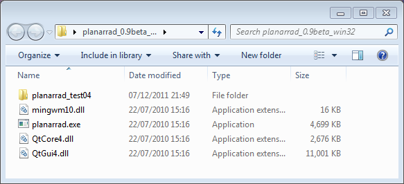

# Windows installation

The Windows version of PlanarRad is distributed as a zipped folder of files. There is no installer as such, installation simply means unzipping this folder and putting it somewhere on your system.
Installation

The Windows version of PlanarRad is distributed in a zipped file called something like:
```
planarrad_free_win32_0.9beta_2010_07_22.zip
```
Check the [previous versions page](../misc/previous_versions.md) for files.
Unzip this with whatever method is available, and you should get a folder with these files (or similar):



The PlanarRad program is 'planarrad.exe'. The three 'dll' files are library code that PlanarRad needs to find when it runs. It is simplest to just keep the dlls in the same folder as the exe file. PlanarRad uses [Qt](http://qt.nokia.com/) for the Windows front-end, which is the reason for QtCore4.dll and QtGui4.dll. If Qt is already installed on the system these dlls may be superfluous, but bear in mind it's possible the installed Qt may be incompatible version. The file 'mingwm10.dll' is required because PlanarRad for Windows is cross compiled under Linux using the [MinGW](http://www.mingw.org/) toolchain.

The folder 'planarrad_test04' contains example files for running PlanarRad.

**IMPORTANT** - be sure to actually physically unzip the folder. Some versions of windows will allow you to browse in the zip folder as if it were a normal folder and even run planarrad.exe - but it won't run and the error will be that it cannot find a 'dll' file that is present in the folder.
Testing

If you double click on 'planarrad.exe' directly in the unzipped folder the program should start with no problems.

Refer to the pages [Getting started with PlanarRad](./Getting%20started%20with%20PlanarRad.md) or Running test model 04 to start using PlanarRad. 